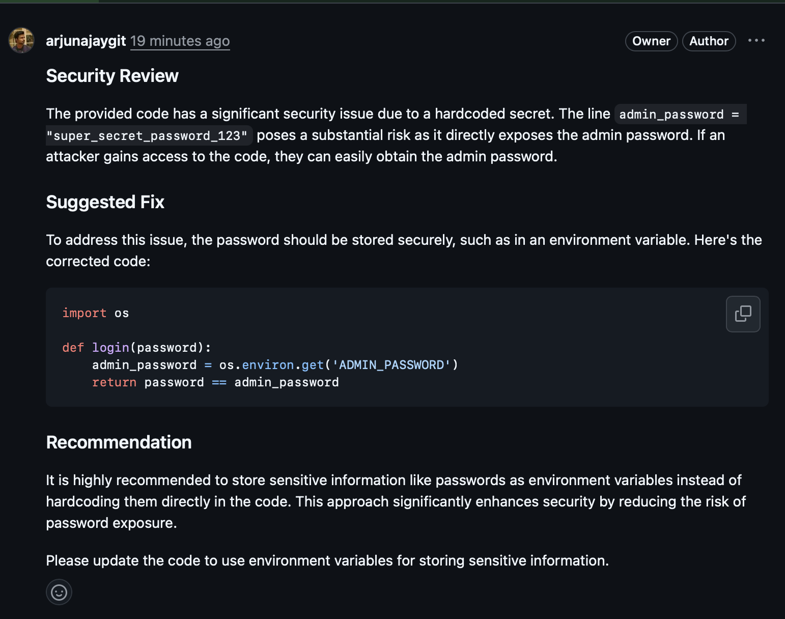
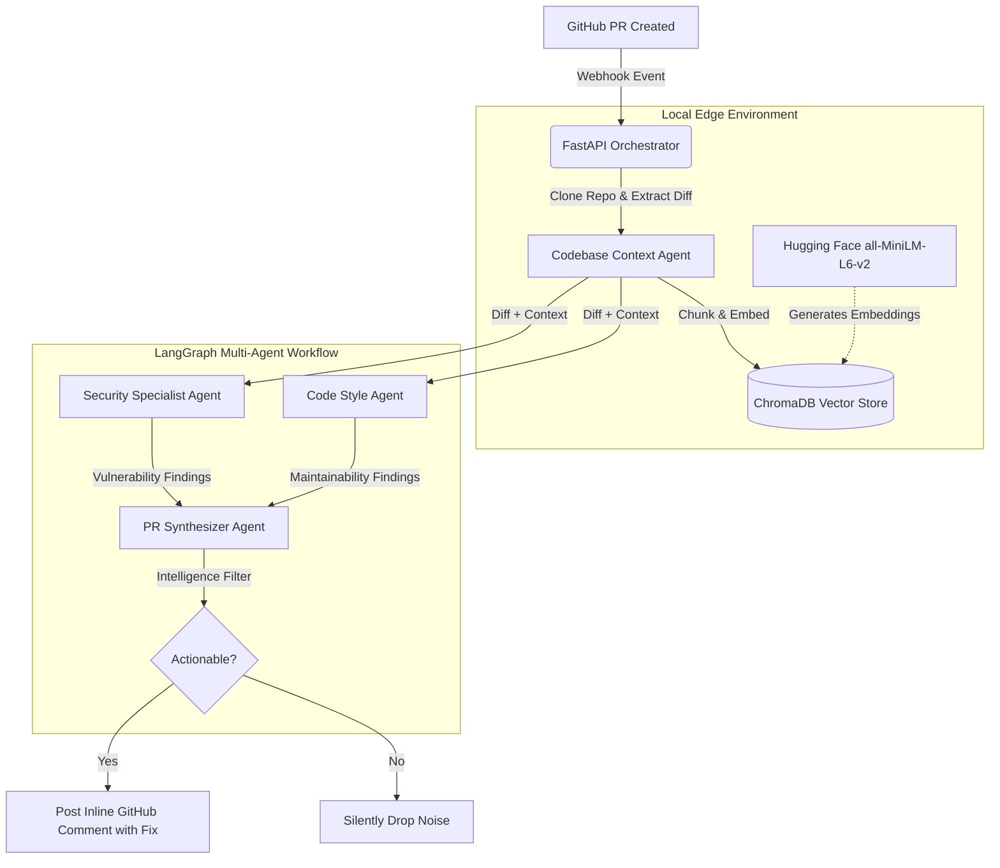

# 🛡️ SentinelOps
**Autonomous, Multi-Agent DevSecOps Code Reviewer**

[](https://www.python.org/downloads/)
[](https://fastapi.tiangolo.com/)
[](#)
[](#)

*SentinelOps is an event-driven webhook service. It listens to GitHub Pull Requests, indexes the entire repository using localized embeddings (RAG), and uses specialized AI agents to post actionable, inline security and architectural fixes directly to your code.*

---

## 📸 See It In Action


---

## 🏗️ System Architecture

Unlike standard LLM wrappers, SentinelOps utilizes a stateful, multi-agent LangGraph architecture to prevent hallucination and reduce developer fatigue. It strictly keeps repository context local to ensure data sovereignty.



---

## 🚀 Key Features

- **Multi-Agent Orchestration:** Powered by LangGraph, SentinelOps deploys specialized autonomous agents for parallel analysis:
  - 🔒 **Security Agent:** Hunts for injection flaws, hardcoded secrets, and weak cryptography.
  - 🎨 **Style Agent:** Enforces DRY principles and prevents memory leaks or async blocking.
  - 🧠 **Synthesizer Agent:** Acts as the Lead Reviewer, deduplicating findings and generating precise Markdown code suggestions that developers can safely copy and paste into their IDE.
- **RAG Architecture (Retrieval-Augmented Generation):** Unlike standard bots that only read the PR diff, SentinelOps clones the repository and builds a local vector database using **ChromaDB** and **Hugging Face (`all-MiniLM-L6-v2`)**. This gives the AI deep architectural context to prevent hallucinations.
- **Developer Fatigue Prevention:** A strict intelligence filter explicitly drops pedantic noise like formatting nits and missing docstrings, ensuring developers only see high-value, actionable alerts.
- **Lightning Fast Inference:** Powered by **Groq** (`llama-3.3-70b-versatile`), providing instant, free inference.
- **Cloud-Ready Containerization:** Fully containerized via Docker with DevSecOps footprint optimizations (CPU-only PyTorch) for fast, lightweight deployment.

---

## ⚡ Core Tech Stack
- **Backend:** FastAPI, Python, Uvicorn
- **AI Orchestration:** LangGraph, LangChain
- **Local RAG Pipeline:** ChromaDB, Hugging Face `sentence-transformers`
- **LLM Inference:** Groq (`llama-3.3-70b-versatile`)
- **Git Operations:** PyGithub, GitPython, GitHub Webhooks
- **Deployment:** Docker

---

## ⚙️ GitHub Configuration Guide

To fully integrate SentinelOps as a strict CI gatekeeper, you must configure your GitHub repository and Personal Access Token properly.

### 1. Personal Access Token Permissions
For Enterprise security, it is highly recommended to use a **Fine-grained Personal Access Token** following the principle of least privilege. 

Grant the following permissions to your token:
- **Administration (Read and write):** Required only if you plan to use `setup_repo.py` to automate branch protection.
- **Commit statuses (Read and write):** Allows SentinelOps to post the yellow/red/green CI gate dots on pull requests.
- **Contents (Read-only):** Allows SentinelOps to securely `git clone` the codebase for RAG context without accidentally modifying your source code.
- **Pull requests (Read and write):** Allows SentinelOps to post the inline code review comments.
- **Metadata (Read-only):** Automatically assigned by GitHub.

*(If you are using a Classic Token, simply check the `repo` scope).*

### 2. Configure Webhooks
1. Go to your Repository Settings > **Webhooks** > **Add webhook**.
2. **Payload URL:** Your server/ngrok URL appended with `/webhook` (e.g., `https://your-ngrok.app/webhook`).
3. **Content type:** `application/json`.
4. **Secret:** Match the `WEBHOOK_SECRET` in your `.env`.
5. **Events:** Select "Let me select individual events", then check **Pull requests**.

### 3. Enforce Strict Branch Protection (Optional)
To physically block the "Merge" button when SentinelOps finds critical security or architectural flaws, you must enforce a Branch Protection rule. We have provided an automated script to configure this for you.

Run the following command in the project root:
```bash
python setup_repo.py --repo your_username/your_repository_name
```
*(This requires your token to have Repository Administration permissions).*

---

## 🚀 Quickstart & Local Testing

### 1. Environment Setup
Create a `.env` file in the root directory. Never commit this file.
```ini
WEBHOOK_SECRET=your_github_webhook_secret
GITHUB_TOKEN=ghp_your_github_pat

# OpenAI-Compatible API Configuration (e.g., Groq, OpenAI, Ollama)
LLM_API_KEY=gsk_your_api_key
LLM_BASE_URL=https://api.groq.com/openai/v1
LLM_MODEL=llama-3.3-70b-versatile
```

### 2. Run the Development Server Locally
```bash
pip install -r requirements.txt
uvicorn app.main:app --reload --port 8000
```

---

## 🐳 Docker Deployment

SentinelOps is built for easy cloud deployment. The Docker image pre-downloads the Hugging Face models to ensure instant startup and prevents runtime downloads on the server.

**Option 1: Pull from Docker Hub (Fastest)**
```bash
docker pull arjunajaydocker/sentinel-ops
docker run -p 8000:8000 --env-file .env arjunajaydocker/sentinel-ops
```

**Option 2: Build Locally from Source**
```bash
docker build -t sentinel-ops .
docker run -p 8000:8000 --env-file .env sentinel-ops
```

---

## 🔗 Webhook & Cloud Routing

Regardless of how you run it (locally or via Docker), the container exposes a `/webhook` endpoint on port `8000`. 

If you are running this locally on your machine, you must use a tool like **ngrok** to route public GitHub traffic to your local port:
```bash
ngrok http 8000
```
Then, go to your **GitHub Repository -> Settings -> Webhooks**, and add `https://<your-ngrok-url>/webhook` as the Payload URL. 

*(If you deploy this image to a cloud provider like AWS or Render, simply use their provided public URL instead of ngrok!)*
