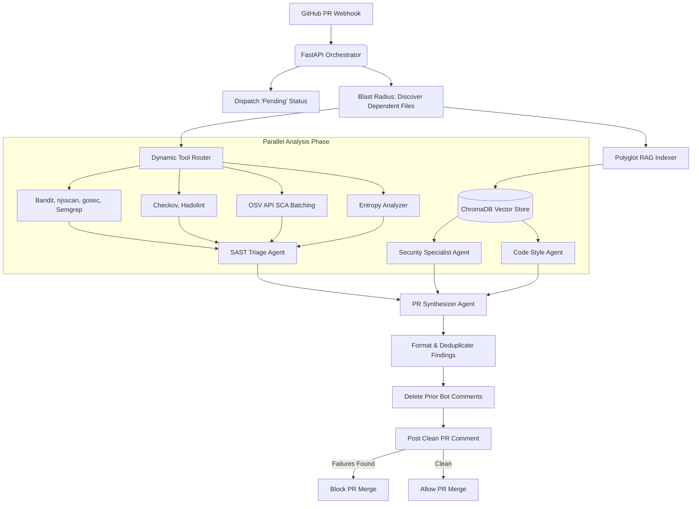

# 🛡️ SentinelOps
**Autonomous, Polyglot Multi-Agent DevSecOps Code Reviewer**

[](https://www.python.org/downloads/)
[](https://fastapi.tiangolo.com/)
[](#)
[](#)

*SentinelOps is an event-driven webhook service that acts as a strict CI/CD gatekeeper. It listens to GitHub Pull Requests, maps architectural dependencies (Blast Radius), and runs a highly parallel, multi-agent LangGraph workflow to post actionable, zero-hallucination security fixes directly to your code.*

---

## 📸 See It In Action


---

## 🏗️ System Architecture

SentinelOps uses a parallel fan-out architecture to maximize speed. It combines deterministic security tools (for zero-hallucination accuracy) with contextual AI agents (for complex logic) without hitting rate limits or OS constraints.



---

## 🚀 Key Features

### 🧠 Advanced Multi-Agent Intelligence
- **Parallel Orchestration (LangGraph):** SentinelOps deploys specialized autonomous agents (Security, Style, and SAST Triage) in parallel, cutting analysis time by 3x.
- **Blast Radius Analysis:** Goes beyond the PR diff. It dynamically maps call-graphs to identify external files that depend on the modified functions, warning developers if they introduce a breaking architectural change.
- **Synthesizer (Lead Reviewer):** The final intelligence gate. It deduplicates findings, strips away pedantic stylistic nits, and generates ready-to-merge Markdown code suggestions.

### 🛡️ Comprehensive DevSecOps Coverage
- **Dynamic SAST Routing:** Automatically detects repository languages and runs Python (Bandit), JS/TS (njsscan), Go (gosec), and global checks (Semgrep, Gitleaks).
- **Infrastructure-as-Code (IaC) Cloud Guard:** Scans Terraform (`.tf`), Dockerfiles, and CI `.yml` files using Checkov and Hadolint to prevent public S3 buckets or root-level containers.
- **Dependency Threat Hunting (SCA):** Detects modifications to `requirements.txt` or `package.json` and batches asynchronous queries to the Google OSV API to block known CVEs.
- **EntropyGuard (Obfuscation Analysis):** Calculates Shannon Entropy on newly added lines to mathematically detect obfuscated malicious payloads hiding in `eval()` or `exec()` sinks.

---

## ⚡ Core Tech Stack
- **Supported Languages:** Python, JavaScript, TypeScript, Go, Terraform, Docker, YAML
- **Backend:** FastAPI, Python, Uvicorn, asyncio
- **AI Orchestration:** LangGraph, LangChain
- **Local RAG Pipeline:** ChromaDB, Hugging Face `sentence-transformers`
- **Security Engines:** Bandit, njsscan, gosec, Semgrep, Gitleaks, Checkov, Hadolint, OSV API
- **LLM Inference:** Groq (`llama-3.3-70b-versatile`) or any OpenAI-compatible endpoint.

---

## ⚙️ GitHub Configuration Guide

### 1. Personal Access Token Permissions
Use a **Fine-grained Personal Access Token** with the following permissions:
- **Commit statuses (Read and write):** To block/allow merges.
- **Contents (Read-only):** To securely git clone the codebase.
- **Pull requests (Read and write):** To post code review comments.
- **Metadata (Read-only):** Automatically assigned.

### 2. Configure Webhooks
1. Go to your Repository Settings > **Webhooks** > **Add webhook**.
2. **Payload URL:** Your server/ngrok URL appended with `/webhook` (e.g., `https://api.yourdomain.com/webhook`).
3. **Content type:** `application/json`.
4. **Secret:** Match the `WEBHOOK_SECRET` in your `.env`.
5. **Events:** Select "Let me select individual events", then check **Pull requests**.

---

## 🚀 Quickstart & Local Testing

### 1. Environment Setup
Create a `.env` file in the root directory. Never commit this file.
```ini
WEBHOOK_SECRET=your_github_webhook_secret
GITHUB_TOKEN=ghp_your_github_pat

# OpenAI-Compatible API Configuration (e.g., Groq, OpenAI, Ollama)
LLM_API_KEY=gsk_your_api_key
LLM_BASE_URL=https://api.groq.com/openai/v1
LLM_MODEL=llama-3.3-70b-versatile
```

### 2. Run the Development Server
```bash
pip install -r requirements.txt
uvicorn app.main:app --reload --port 8000
```

### 3. Run the Test Suite
Verify language detection, SAST routing, and Blast Radius mapping offline:
```bash
pytest -v
```

---

## 🐳 Docker Deployment

The Docker image runs as a non-root user (`sentinel_user`) and pre-downloads Hugging Face models for instant cold starts.

**Run via Docker Hub:**
```bash
docker pull arjunajaydocker/sentinel-ops
docker run -p 8000:8000 --env-file .env arjunajaydocker/sentinel-ops
```

---

## ⚠️ Known Limitations & Future Architecture

SentinelOps is designed for high-speed, parallel analysis, but adheres to strict enterprise constraints:
- **The "Mega PR" Limit:** PRs modifying thousands of files risk hitting LLM provider Rate Limits (RPM/TPM). Future iterations will introduce Adaptive Scanning (bypassing the LLM for massive refactors and relying purely on deterministic SAST).
- **Context Window Overflow:** Excessively large files (e.g., 15MB minified JS bundles or SQL dumps) will exceed LLM context windows. These files are safely caught by `try/except` guards but are skipped for AI review.
- **Prompt Injection:** As with all LLM-based tools, adversarial prompt injection via malicious code comments is a structural reality. SentinelOps mitigates this by running deterministic SAST scanners in parallel to the AI—ensuring actual vulnerabilities are flagged regardless of LLM compliance.
