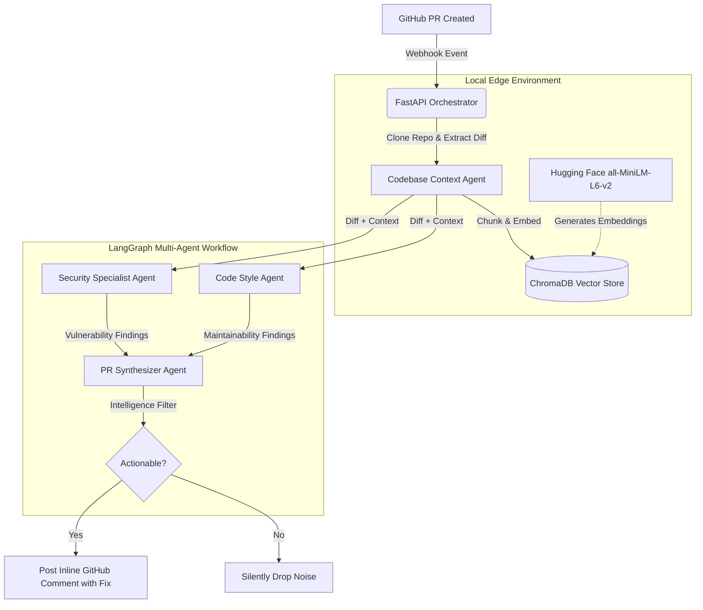

# 🛡️ SentinelOps
**Autonomous, Multi-Agent DevSecOps Code Reviewer**

[](https://www.python.org/downloads/)
[](https://fastapi.tiangolo.com/)
[](#)
[](#)

*SentinelOps is an event-driven webhook service. It listens to GitHub Pull Requests, indexes the entire repository using localized embeddings (RAG), and uses specialized AI agents to post actionable, inline security and architectural fixes directly to your code.*

---

## 📸 See It In Action
> *(Note: Replace this block with a GIF or a clean screenshot showing your bot's comment with a ```suggestion``` block on a real GitHub PR)*

---

## 🏗️ System Architecture

Unlike standard LLM wrappers, SentinelOps utilizes a stateful, multi-agent LangGraph architecture to prevent hallucination and reduce developer fatigue. It strictly keeps repository context local to ensure data sovereignty.



---

## ⚡ Core Tech Stack
- **Backend:** FastAPI, Python, Uvicorn
- **AI Orchestration:** LangGraph, LangChain
- **Local RAG Pipeline:** ChromaDB, Hugging Face `sentence-transformers`
- **LLM Inference:** Groq (`llama-3.3-70b-versatile`)
- **Git Operations:** PyGithub, GitPython, GitHub Webhooks
- **Deployment:** Docker

---

## 🚀 Quickstart & Local Testing

### 1. Environment Setup
Create a `.env` file in the root directory. Never commit this file.
```ini
WEBHOOK_SECRET=your_github_webhook_secret
GITHUB_TOKEN=ghp_your_github_pat
GROQ_API_KEY=gsk_your_groq_api_key
```

### 2. Run the Development Server Locally
```bash
pip install -r requirements.txt
uvicorn app.main:app --reload --port 8000
```

---

## 🐳 Docker Deployment

SentinelOps is built for easy cloud deployment. The Docker image pre-downloads the Hugging Face models to ensure instant startup and prevents runtime downloads on the server.

**Option 1: Pull from Docker Hub (Fastest)**
```bash
docker pull arjunajaydocker/sentinel-ops
docker run -p 8000:8000 --env-file .env arjunajaydocker/sentinel-ops
```

**Option 2: Build Locally from Source**
```bash
docker build -t sentinel-ops .
docker run -p 8000:8000 --env-file .env sentinel-ops
```

---

## 🔗 Webhook & Cloud Routing

Regardless of how you run it (locally or via Docker), the container exposes a `/webhook` endpoint on port `8000`. 

If you are running this locally on your machine, you must use a tool like **ngrok** to route public GitHub traffic to your local port:
```bash
ngrok http 8000
```
Then, go to your **GitHub Repository -> Settings -> Webhooks**, and add `https://<your-ngrok-url>/webhook` as the Payload URL. 

*(If you deploy this image to a cloud provider like AWS or Render, simply use their provided public URL instead of ngrok!)*
